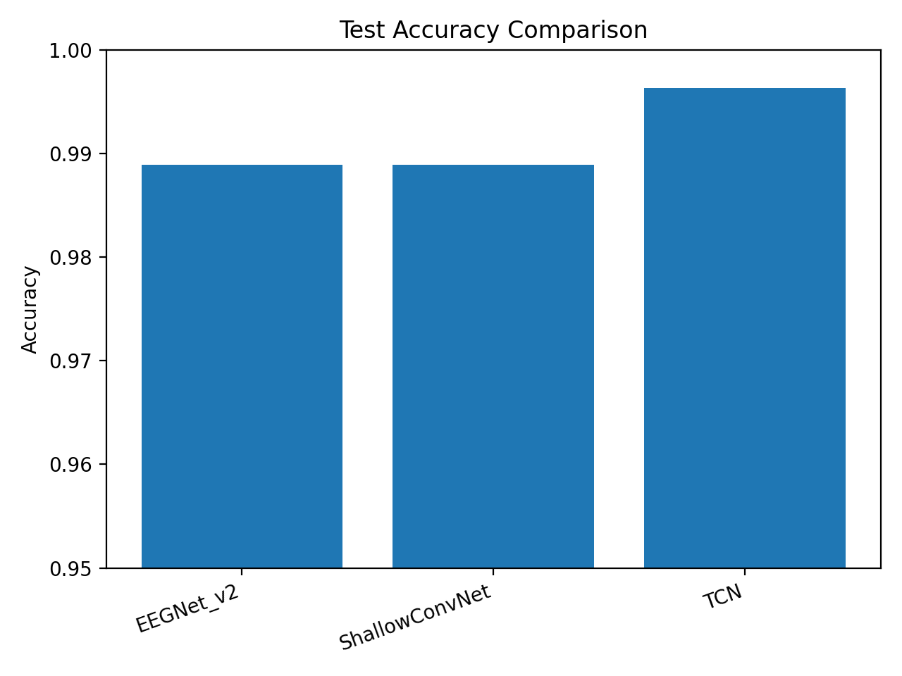
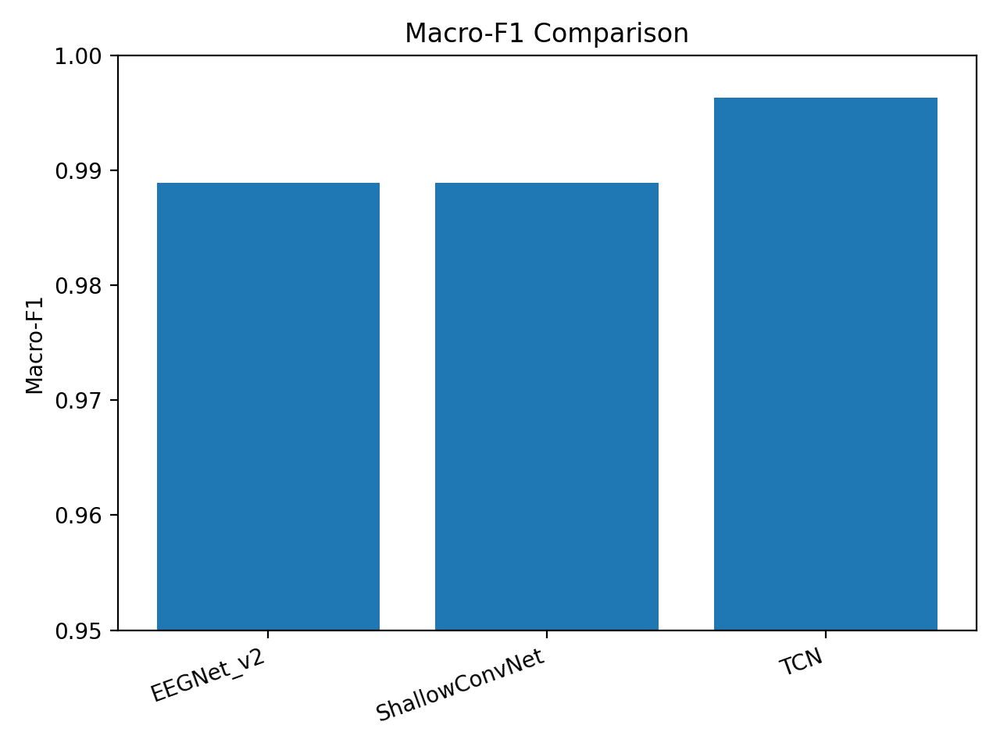
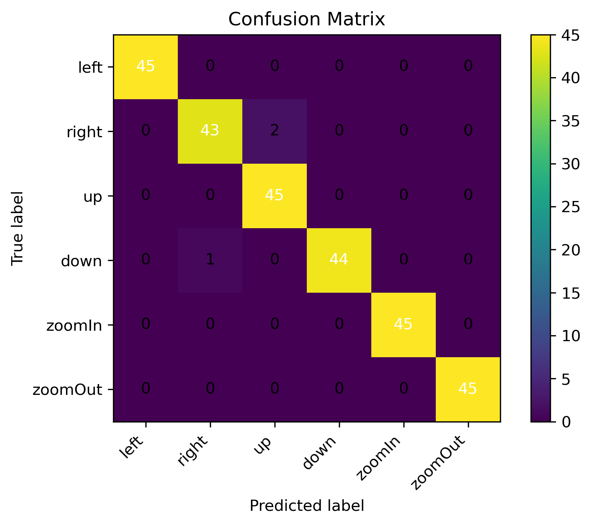
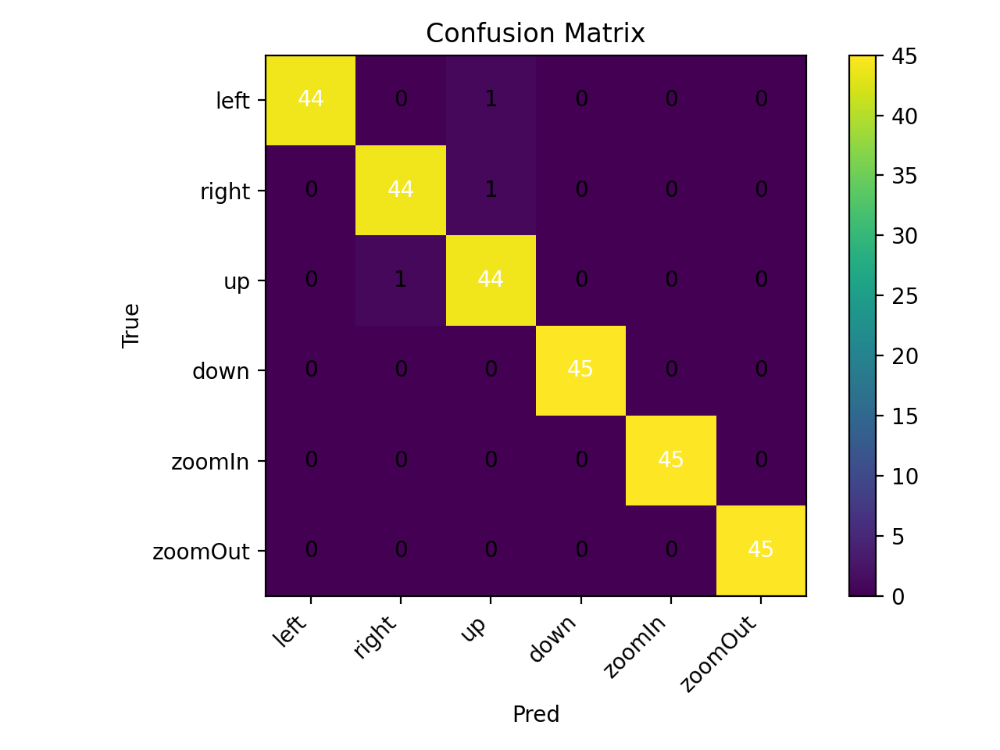
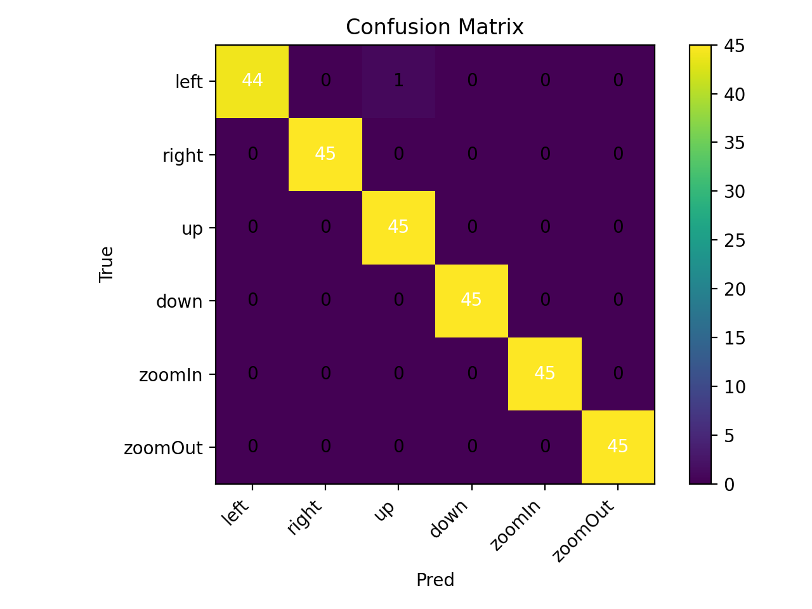

# 🧠 EEG BCI 3-Model Comparison

## Abstract

This project investigates deep learning baselines for 6-class Motor Imagery (MI) EEG classification.
We compare three representative architectures:

- **EEGNet v2** (compact spatial-temporal CNN)
- **ShallowConvNet** (CSP-inspired bandpower model)
- **Temporal Convolutional Network (TCN)** (long-range temporal modeling)

The goal is to establish robust baselines and analyze spatial vs temporal modeling behavior
in multi-class MI EEG classification.

---

## Methodology

### Dataset

- Sampling Rate: 250 Hz  
- Epoch Length: 4 seconds (1000 samples)  
- Channels: 24  
- Frequency Band: 8–30 Hz (μ / β rhythm)  

6-class Motor Imagery:

| Label | Task |
|-------|------|
| left | Left hand imagery |
| right | Right hand imagery |
| up | Both hands imagery |
| down | Feet imagery |
| zoomIn | Tongue imagery |
| zoomOut | Rest |

---

### Preprocessing

- Optional 8–30 Hz bandpass filter  
- Per-channel z-score normalization  
- Stratified train/validation/test split  

---

### Models

#### 1️⃣ EEGNet v2
- Depthwise spatial convolution
- Separable convolution
- Compact parameter design

#### 2️⃣ ShallowConvNet
- Temporal filtering
- Depthwise spatial filtering (CSP-like)
- Log-power nonlinearity

#### 3️⃣ TCN
- Dilated causal convolutions
- Residual blocks
- Global average pooling

---

## Results

After training:

```bash
python scripts/compare_models.py
```

The following figures are automatically generated:

### 🔥 Test Accuracy Comparison



### 🔥 Macro-F1 Comparison



---

## Individual Model Confusion Matrices

### EEGNet v2


### ShallowConvNet


### TCN


---

## Performance Ranking (Auto-Sorted Concept)

Models should be ranked based on:

1. Test Accuracy (primary)
2. Macro-F1 (secondary)
3. Stability across seeds (future work)

Best model can be highlighted manually after comparison results.

---

## 🏆 LaTeX Table Template (Paper Ready)

Use this in your paper:

```latex
\begin{table}[h]
\centering
\caption{6-Class MI EEG Classification Performance}
\begin{tabular}{lccc}
\hline
Model & Accuracy & Macro-F1 & Test Loss \\
\hline
EEGNet v2 & XX.XX & XX.XX & XX.XX \\
ShallowConvNet & XX.XX & XX.XX & XX.XX \\
TCN & XX.XX & XX.XX & XX.XX \\
\hline
\end{tabular}
\end{table}
```

Replace values using `result_compare/comparison.csv`.

---

## Discussion

- EEGNet emphasizes spatial filtering efficiency.
- ShallowConvNet approximates classical CSP-style bandpower extraction.
- TCN captures long temporal dependencies.

This comparison provides insight into the importance of temporal receptive field
size in multi-class Motor Imagery EEG classification.

---

## Tech Stack

- Python
- PyTorch
- NumPy
- Pandas
- scikit-learn
- Matplotlib
- SciPy

---

## Author

Kanye Kim  
EEG · BCI · Deep Learning
